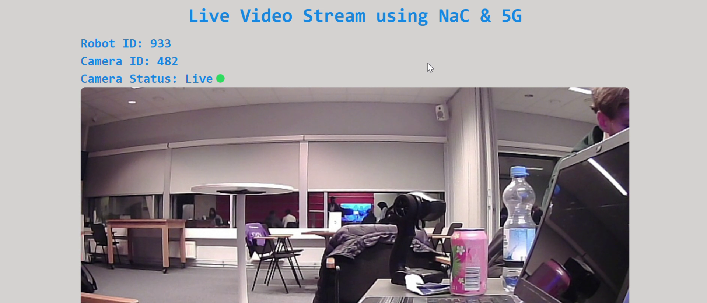
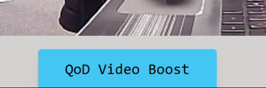
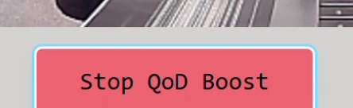
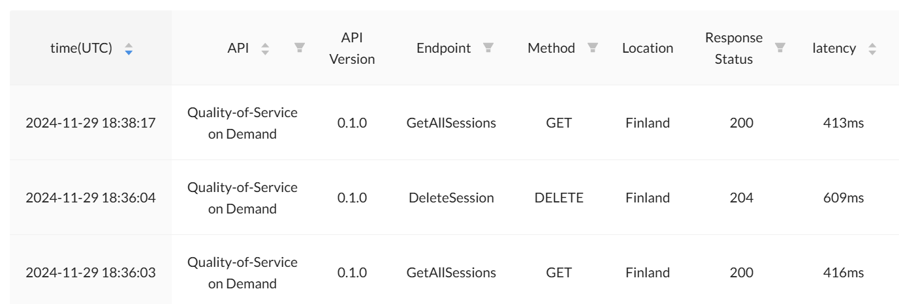

# Solution for Ultrahack Unbreakable Connectivity Hackathon


## Team Members
- **Member 1**: [GitHub Profile](https://github.com/member1)
- **Member 2**: [GitHub Profile](https://github.com/member2)
- **Member 3**: [GitHub Profile](https://github.com/member3)
- **Member 4**: [GitHub Profile](https://github.com/member4)
- **Member 5**: [GitHub Profile](https://github.com/member5)
- **Member 6**: [GitHub Profile](https://github.com/member6)
- **Member 7**: [GitHub Profile](https://github.com/vlad-beresnev)

# Live Video Stream using NaC & 5G
## Overview
This project demonstrates a live video streaming application using Network as Code (NaC) and 5G technology. The project is divided into two main components: the frontend and the backend.

## Project Structure
- `./frontend/src/App.jsx`: The frontend component built with React.
- `./backend/cv2Server.py`: The backend component built with Flask and OpenCV.

## Frontend: ./frontend/src/app.jsx
The frontend is responsible for displaying the live video stream and providing user interaction options.

### Key Features
- Displays live video stream from the backend.

- Provides a "QoD Video Boost" button to enhance video quality.

- Toggles between "QoD Video Boost" and "Stop QoD Session" buttons based on user interaction.


## Backend: ./backend/cv2Server.py
The backend is responsible for capturing video from the camera, processing it using OpenCV, and serving it to the frontend via a Flask web server.

### Key Features
- Captures video frames from the camera using OpenCV.
    ```python
    def generate_frames():
        cap = cv2.VideoCapture(0)  # Open the default webcam
        while True:
            success, frame = cap.read()  # Capture frame-by-frame
            if not success:
                break

            # Encode the frame in JPEG format
            ret, buffer = cv2.imencode('.jpg', frame)
            if not ret:
                continue

            # Convert the buffer to bytes and yield it
            stream = io.BytesIO(buffer)
            stream.seek(0)
            yield (b'--frame\r\n'
                b'Content-Type: image/jpeg\r\n\r\n' + stream.read() + b'\r\n')
            stream.truncate()
        cap.release()  # Release the webcam

- Streams the video frames to the frontend using Flask.
    ```python
    @app.route('/video_feed', methods=['GET'])
    def video_feed():
        frames_response = Response(generate_frames(), mimetype='multipart/x-mixed-replace; boundary=frame')
        return frames_response

- Applies a Quality of Service (QoS) profile to optimize for low latency using NaC (Network as Code) by Nokia.


### Endpoints
- `/video_feed`: Streams the live video feed to the frontend.

### Dependencies
- Flask: A lightweight WSGI web application framework.
- OpenCV: A library for computer vision tasks.
- NaC: Network as Code for managing network resources.

### How to Run
1. Install the required dependencies:
   ```bash
   pip install flask opencv-python network_as_code